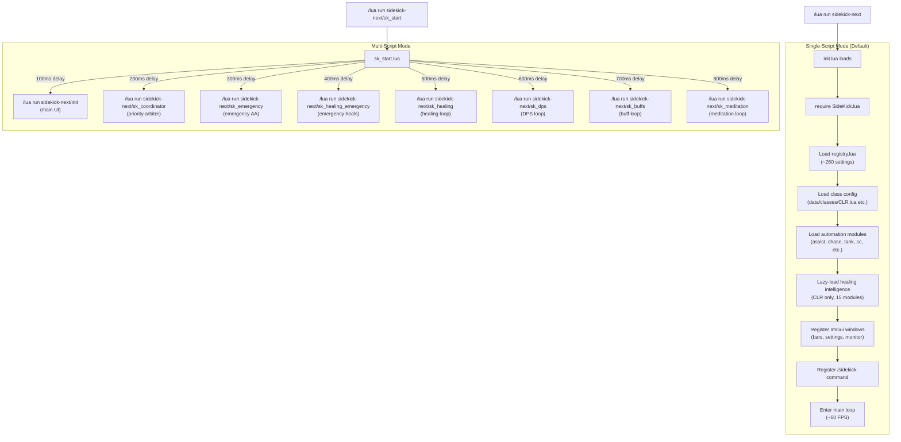
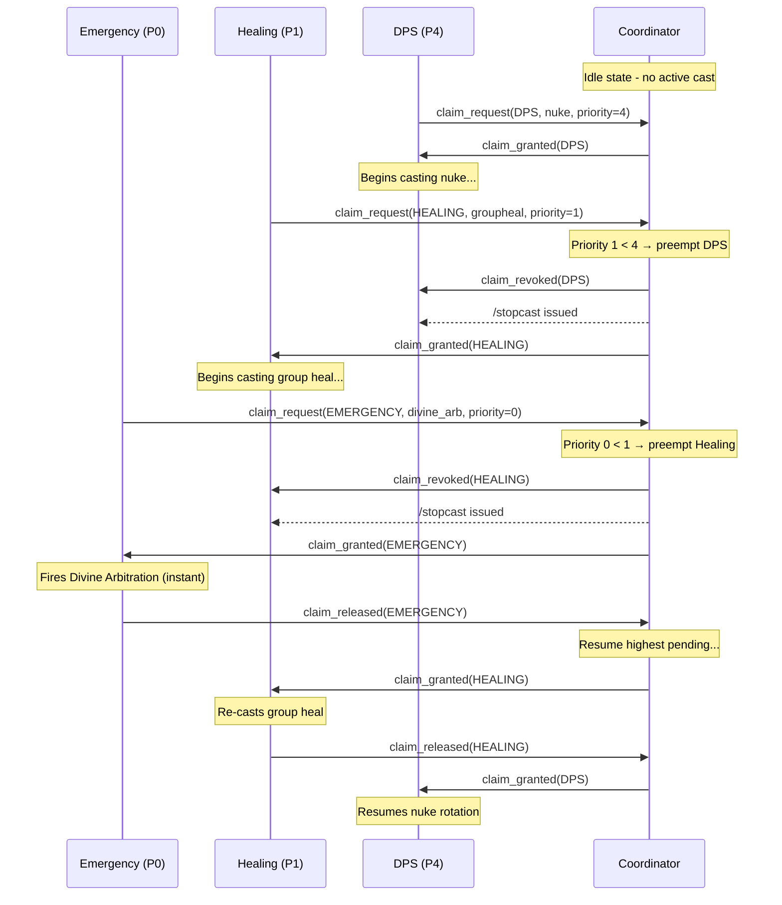
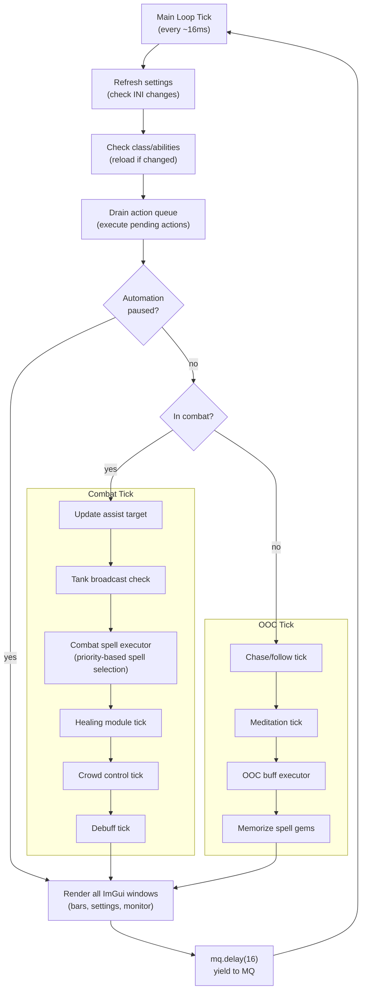
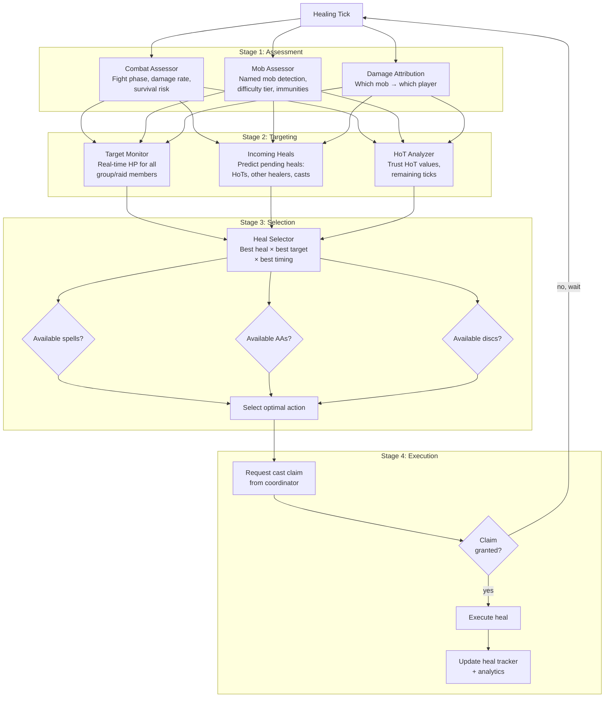
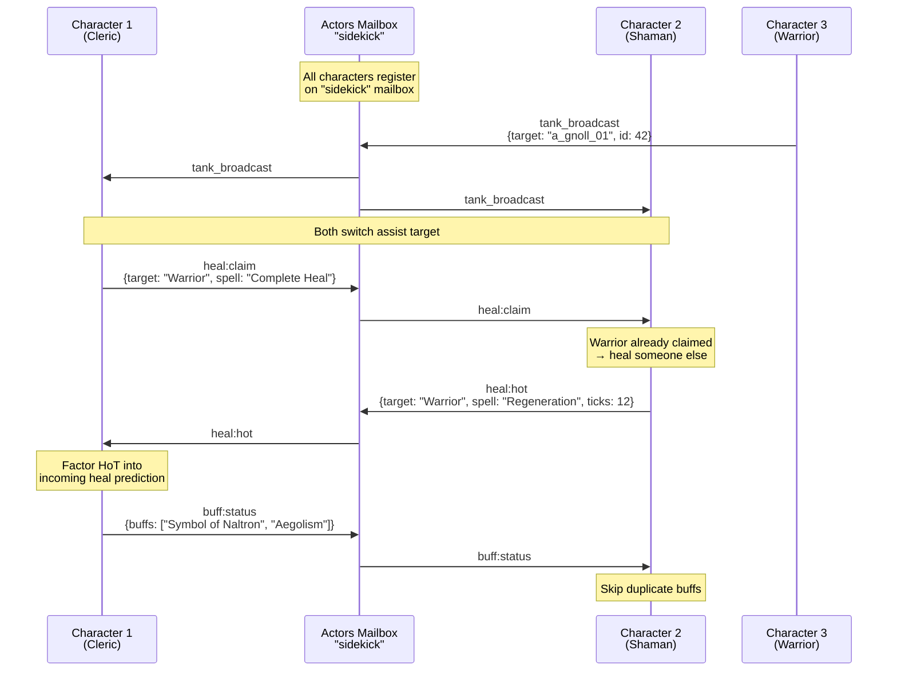
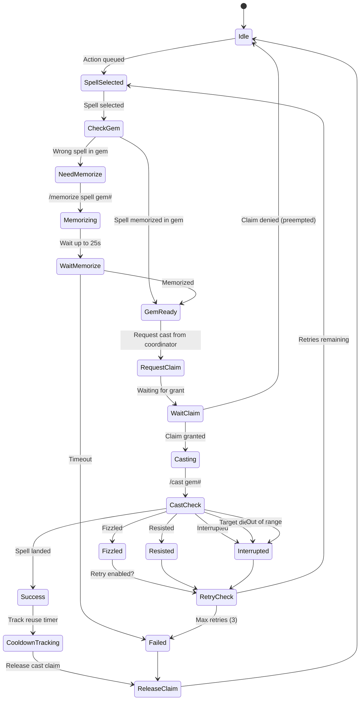
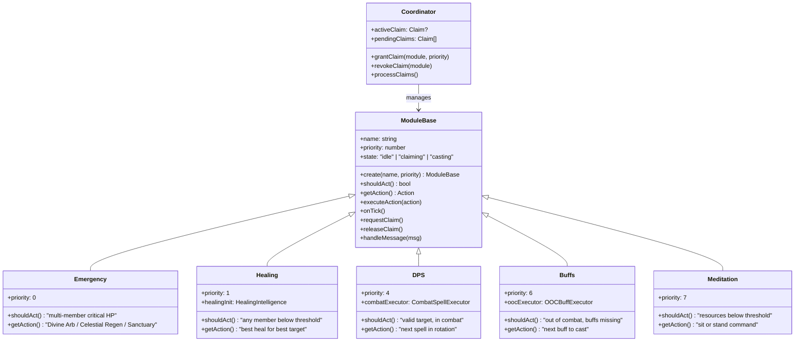
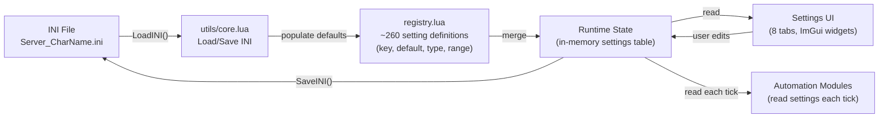

# SideKick-Next User Guide

A comprehensive automation framework for EverQuest via MacroQuest. SideKick provides intelligent class-specific automation, multi-character coordination, and a fully customizable ImGui interface.

**Supported classes:** BER, BRD, CLR, DRU, ENC, MAG, MNK, NEC, PAL, RNG, ROG, SHD, SHM, WAR

---

## Table of Contents

- [Part 1 - User Guide](#part-1---user-guide)
  - [Installation](#installation)
  - [Quick Start](#quick-start)
  - [UI Tour](#ui-tour)
  - [Configuration](#configuration)
  - [Automation Modes](#automation-modes)
  - [Class-Specific Features](#class-specific-features)
  - [Multi-Box Coordination](#multi-box-coordination)
  - [Commands Reference](#commands-reference)
- [Part 2 - Architecture Guide](#part-2---architecture-guide)
  - [System Overview](#system-overview)
  - [Startup Flow](#startup-flow)
  - [Priority Coordinator](#priority-coordinator)
  - [Main Loop](#main-loop)
  - [Healing Intelligence Pipeline](#healing-intelligence-pipeline)
  - [Actors Communication](#actors-communication)
  - [Spell Execution Flow](#spell-execution-flow)
  - [Module Architecture](#module-architecture)
  - [Settings Data Flow](#settings-data-flow)
- [Part 3 - Reference](#part-3---reference)
  - [Settings Reference](#settings-reference)
  - [Priority Tiers](#priority-tiers)
  - [File Map](#file-map)
  - [Glossary](#glossary)

---

# Part 1 - User Guide

## Installation

### Prerequisites

- **MacroQuest** (latest build) with Lua plugin enabled
- **MQ2DanNet** plugin loaded (for cross-character queries)
- **MQ2Nav** plugin recommended (for chase/navigation)

### File Placement

Place the `sidekick-next` folder in your MacroQuest `lua` directory:

```
MacroQuest/
  lua/
    sidekick-next/
      init.lua
      SideKick.lua
      registry.lua
      ...
```

### First Run

Log into EverQuest and type:

```
/lua run sidekick-next
```

The main window and ability bars will appear. Settings are auto-saved to:
```
<MQ Config Dir>/Server_CharacterName.ini
```

## Quick Start

1. **Launch**: `/lua run sidekick-next` (or `/sidekick` if already running to toggle the window)
2. **Open settings**: `/sidekick settings` or click the cog icon
3. **Pick your theme**: Settings > UI tab > Theme dropdown
4. **Enable automation**: Settings > Automation tab > set Automation Level to `auto`
5. **Enable assist**: Settings > Automation tab > Assist section > toggle Enabled
6. **Enable chase**: Settings > Automation tab > Chase section > toggle Enabled, pick a role (MA/MT/Leader)

That's the minimum to get an automated character following and assisting.

## UI Tour

SideKick renders several ImGui windows, each independently positionable and anchorable.

### Main Bar

The primary ability bar showing your class's AAs, disciplines, and spells as icon buttons.

- **Cooldown overlays**: Grayed-out icons with timer countdown
- **Ready pulse**: Glowing animation when an ability comes off cooldown
- **Click to activate**: Left-click fires the ability
- **Hover tooltip**: Shows ability name, reuse time, and current state
- **Layout**: Configurable rows (1-6), cell size (32-120px), gap, and padding

### Special Bar

Class-specific special abilities displayed separately from the main bar. Berserker disciplines, tank defensives, etc. Supports single-row, single-column, or grid layouts.

### Disc Bar

Discipline-specific bar for melee/tank classes. Shows active and available disciplines with cooldown tracking.

### Item Bar

Clickable items (clicky gear) with cooldown tracking. Configure which items appear in Settings > Items.

### Settings Window

Tabbed configuration panel with 8 tabs (see [Configuration](#configuration) below).

### Healing Monitor (CLR only)

Real-time display of the healing intelligence system showing:
- Current heal targets and predicted incoming heals
- Combat assessment (fight phase, damage rate, survival risk)
- Heal efficiency analytics (overhealing %, casts per minute)
- HoT tracking across characters

Open with: `/sidekick healmonitor`

### Aggro Warning

Overlay that flashes when you have aggro above the configured threshold.

## Configuration

Settings are organized into 8 tabs in the Settings window.

### UI Tab

Controls visual appearance and window positioning.

| Setting | Purpose |
|---------|---------|
| Theme | Color scheme: Classic, ClassicEQ, ClassicEQ Textured, Dark, Neon |
| Sync Theme with GT | Match theme to GroupTarget window |
| Manual Move/Resize | Allow dragging windows freely |
| Button Scale | Scale factor for all buttons (0.5x - 3.0x) |
| Font Scale | Scale factor for text (0.5x - 3.0x) |

Each bar (Ability, Special, Disc, Item) has its own subsection with:
- **Cell size**: Button dimensions in pixels
- **Rows**: Number of rows in the grid
- **Gap / Padding**: Spacing between and around buttons
- **Background Alpha**: Bar background transparency (0 = invisible, 1 = opaque)
- **Anchor**: Snap to another window (none / left / right / above / below)
- **Anchor Target**: Which window to snap to (default: `grouptarget`)
- **Anchor Gap**: Pixel spacing from the anchor target

### Automation Tab

Controls all automated behaviors.

**Chase Section**
| Setting | Default | Purpose |
|---------|---------|---------|
| Enabled | off | Toggle chase automation |
| Role | MA | Who to follow: MA, MT, Leader, Raid1-3, or by name |
| Target | (empty) | Character name if Role = byname |
| Distance | 30 | Units to maintain from chase target |

**Assist Section**
| Setting | Default | Purpose |
|---------|---------|---------|
| Enabled | off | Toggle assist automation |
| Mode | group | Target source: group, raid1-3, or byname |
| Name | (empty) | Character name if Mode = byname |
| Engage At | 97% | Target HP% to start attacking |
| Range | 100 | Maximum assist range |

**Meditation Section**
| Setting | Default | Purpose |
|---------|---------|---------|
| Mode | off | When to meditate: off, ooc (out of combat), in combat |
| HP Start/Stop | 70% / 95% | HP range that triggers sit/stand |
| Mana Start/Stop | 50% / 95% | Mana range that triggers sit/stand |
| End Start/Stop | 60% / 95% | Endurance range that triggers sit/stand |
| Aggro Check | on | Prevent sitting if aggro exceeds threshold |
| Aggro Threshold | 95% | Stand up if aggro exceeds this |
| Post-Combat Delay | 2s | Wait time after combat before sitting |

**Burn Section**
| Setting | Default | Purpose |
|---------|---------|---------|
| Duration | 30s | How long burn mode stays active |

### Healing Tab

For **Clerics**: Opens the Intelligent Healing configuration (see [Cleric Healing Intelligence](#cleric-healing-intelligence)).

For **other healing classes**: Provides tiered heal settings:
| Setting | Default | Purpose |
|---------|---------|---------|
| Main Heal Point | 80% | HP% to trigger main heal |
| Big Heal Point | 50% | HP% to trigger big/fast heal |
| Group Heal Point | 75% | HP% for group heal |
| Group Injure Count | 2 | Members below threshold to trigger group heal |
| Pet Heals | off | Include pets in healing |
| HoT Usage | on | Use heal-over-time spells |
| Coordinate via Actors | on | Share heal claims with other characters |

### Buffs Tab

Configure out-of-combat buff automation. Set which buffs to maintain, buff pets, and coordinate with other characters.

### Items Tab

Select which clickable items appear in the Item Bar.

### Integration Tab

| Setting | Default | Purpose |
|---------|---------|---------|
| Actors Enabled | on | Inter-character communication via Actors |

### Animations Tab

Toggle individual UI animation effects:
| Animation | Default | Description |
|-----------|---------|-------------|
| Hover Scale | on | Buttons grow slightly when hovered |
| Click Bounce | on | Buttons bounce when clicked |
| Toggle Pop | on | Pop animation when toggling abilities |
| Ready Pulse | on | Glow when ability comes off cooldown |
| Cooldown Color Tween | on | Smooth color transition during cooldowns |
| Toggle Color Tween | on | Smooth color on toggle state change |
| Stagger Animation | on | Buttons appear one-by-one on load |
| Low Resource Warning | on | Glow effect when HP/mana is low |
| Damage Flash | on | Flash effect when taking damage |

## Automation Modes

The `AutomationLevel` setting controls how much SideKick does on its own.

| Level | Behavior |
|-------|----------|
| **Manual** | UI only. Shows bars and cooldowns but takes no automated actions. You click buttons to fire abilities. |
| **Hybrid** | Defensive automation only. Auto-heals, auto-cures, emergency responses. You control offensive actions. |
| **Auto** | Full automation. Assist, DPS rotations, healing, buffing, CC, debuffing - everything enabled by your settings. |

**Global Pause**: The `AutomationPaused` toggle freezes all automation regardless of level. Useful for manual intervention during tricky fights.

## Class-Specific Features

### Cleric Healing Intelligence

CLR characters get a dedicated healing intelligence subsystem with 15 specialized modules:

- **Combat Assessor**: Evaluates fight phase (opening, sustained, critical), damage rate, and survival risk
- **Target Monitor**: Real-time HP tracking for all group/raid members
- **Incoming Heals**: Predicts incoming heals from HoTs, other healers, and pending casts
- **Mob Assessor**: Identifies named mobs, difficulty tiers, and spell immunity
- **Heal Selector**: Picks the optimal heal (spell, AA, or disc) for the optimal target at the optimal time
- **Damage Attribution**: Tracks which mob is damaging which player
- **Analytics**: Efficiency metrics (overhealing %, casts per minute, mana efficiency)

Emergency abilities (Divine Arbitration, Celestial Regen, Sanctuary) trigger automatically when multiple members reach critical HP.

### Tank Classes (WAR, PAL, SHD)

- **Tank Mode**: Automatic AoE aggro management
- **AoE Threshold**: Configurable minimum mob count before using AoE abilities
- **Safe AE Check**: Skip AoE if mobs are mezzed
- **Repositioning**: Automatic positioning with cooldown
- **Dragon Positioning**: Special angle-based positioning for dragon fights

### Crowd Control (ENC, BRD, NEC)

- **Auto-Mez**: Mez targets on XTarget up to configurable max
- **AoE Mez**: Triggers when mob count exceeds threshold
- **Fast Mez**: Prioritize quick-casting mez spells
- **Refresh Window**: Re-mez before it drops (default: 6s before expiry)
- **Actor Coordination**: Prevents double-mezzing across characters

### Debuffers (SHM, ENC, MAG)

- **Auto-Slow / Malo / Tash / Cripple**: Toggle each debuff type
- **Task Mob Debuffing**: Apply debuffs to all task mobs
- **Self-Heal Priority**: Pause debuffing when HP is low
- **Actor Coordination**: Prevents duplicate debuffs across characters

### Melee DPS (BER, MNK, ROG, RNG)

- **Discipline Bar**: Visual display of available discs with cooldowns
- **Burn Mode**: Timed burst DPS toggle
- **Stick Command**: Configurable positioning (`/stick snaproll behind 10 moveback uw`)
- **Dragon Positioning**: Angle-based positioning for large hitbox mobs

### Casters (MAG, NEC, WIZ, DRU)

- **Spell Rotation**: Cycle through configured spells by priority
- **Resist Type Preference**: Target specific resist types
- **Escape Range**: Back away from mobs when too close
- **Interrupt on Emergency**: Stop casting if self-HP drops critically low

## Multi-Box Coordination

SideKick uses the **Actors** messaging system for real-time inter-character communication. No external tools needed beyond MacroQuest's built-in Actors.

### What Gets Coordinated

| Data | Purpose |
|------|---------|
| Heal claims | Prevents two healers targeting the same player |
| HoT tracking | Tracks heal-over-time effects across all healers |
| Buff status | Prevents duplicate buffing |
| Debuff claims | Prevents duplicate slows/tashs/malos |
| Mez claims | Prevents double-mezzing |
| Target updates | Shares current target for assist chains |
| Tank broadcasts | Tank announces primary target to all assisters |
| Burn sync | Coordinate burn cooldown timing |
| Window bounds | Share window positions for UI anchoring |

### Setup

1. Enable Actors in Settings > Integration > Actors Enabled (on by default)
2. Run SideKick on each character
3. Characters auto-discover each other and begin coordinating

### Safe Targeting (KS Prevention)

SideKick checks targets against raid members and actor peers before engaging, preventing accidental kill stealing. Configure in Settings:

| Setting | Default | Purpose |
|---------|---------|---------|
| Safe Targeting | on | Check before engaging new targets |
| Check Raid | on | Verify against raid member targets |
| Check Peers | on | Verify against actor peer targets |

## Commands Reference

### Main Command

`/sidekick [subcommand]` or `/SideKick [subcommand]`

| Subcommand | Action |
|------------|--------|
| *(none)* | Toggle main window |
| `settings` / `options` / `config` | Toggle settings panel |
| `bar` | Toggle ability bar |
| `burn` | Activate burn mode |
| `burnoff` | Deactivate burn mode |
| `chase` | Toggle chase |
| `assist` | Toggle assist |
| `remote` | Toggle remote ability bar |
| `remoteconfig` | Open remote abilities settings |
| `healmonitor` | Toggle healing monitor (CLR) |
| `spellset` / `ss` | Open spell set editor |
| `assistme` | Broadcast assist request to peers |

### Shortcut Commands

| Command | Action |
|---------|--------|
| `/skchaseon` | Enable chase (broadcastable with `/dgge`) |
| `/skchaseoff` | Disable chase (broadcastable with `/dgge`) |
| `/skassistme` | Broadcast assist request |
| `/skactors` | Toggle actors debug window |
| `/skspells [sub]` | Spellbook scanner commands |
| `/skcd [on\|off\|clear\|debug]` | Cooldown debugging |

### Debug Commands

| Command | Action |
|---------|--------|
| `/sidekick debugsettings [on\|off]` | Log settings persistence events |
| `/sidekick actorsdebug` | Open actors debug window |
| `/sidekick coord` | Open coordinator debug window |
| `/sidekick debugcombat gems` | Show spell gems and their types |
| `/sidekick debugcombat state` | Show combat state and target info |
| `/sidekick debugcombat list` | Show castable spells (non-heal) |
| `/sidekick debugooc` | Debug OOC buff executor state |

---

# Part 2 - Architecture Guide

## System Overview

SideKick is a priority-based automation framework where independent modules compete for casting authority through a central coordinator.

```mermaid
graph TB
    subgraph "Entry Points"
        INIT["init.lua"]
        SKSTART["sk_start.lua<br/>(multi-script launcher)"]
    end

    subgraph "Core"
        SK["SideKick.lua<br/>Main Loop & UI"]
        COORD["sk_coordinator.lua<br/>Priority Arbiter"]
        LIB["sk_lib.lua<br/>Constants & Types"]
        BASE["sk_module_base.lua<br/>Module Base Class"]
        REG["registry.lua<br/>Settings Registry"]
    end

    subgraph "Priority Modules"
        EMERG["sk_emergency.lua<br/>Priority 0"]
        HEAL["sk_healing.lua<br/>Priority 1"]
        DPS["sk_dps.lua<br/>Priority 4"]
        BUFFS["sk_buffs.lua<br/>Priority 6"]
        MED["sk_meditation.lua<br/>Priority 7"]
    end

    subgraph "Healing Intelligence (CLR)"
        HINIT["healing/init.lua"]
        HSEL["heal_selector.lua"]
        HTRK["heal_tracker.lua"]
        HTGT["target_monitor.lua"]
        HCOMBAT["combat_assessor.lua"]
        HMOB["mob_assessor.lua"]
        HHOT["hot_analyzer.lua"]
        HDMG["damage_attribution.lua"]
    end

    subgraph "Automation"
        ASSIST["automation/assist.lua"]
        CHASE["automation/chase.lua"]
        TANK["automation/tank.lua"]
        CC["automation/cc.lua"]
        DEBUFF["automation/debuff.lua"]
        CURES["automation/cures.lua"]
        BUFF["automation/buff.lua"]
        BURN["automation/burn.lua"]
        MEDMOD["automation/meditation.lua"]
    end

    subgraph "UI Layer"
        BAR["bar_animated.lua"]
        SBAR["special_bar_animated.lua"]
        DBAR["disc_bar_animated.lua"]
        IBAR["item_bar_animated.lua"]
        SETTINGS["ui/settings.lua"]
        MONITOR["healing/ui/monitor.lua"]
    end

    subgraph "Communication"
        ACTORS["utils/actors_coordinator.lua"]
        SHARED["actors/shareddata.lua"]
    end

    INIT --> SK
    SKSTART -->|spawns| COORD
    SKSTART -->|spawns| EMERG
    SKSTART -->|spawns| HEAL
    SKSTART -->|spawns| DPS
    SKSTART -->|spawns| BUFFS
    SKSTART -->|spawns| MED

    SK --> BAR
    SK --> SBAR
    SK --> DBAR
    SK --> IBAR
    SK --> SETTINGS
    SK --> MONITOR

    SK --> ASSIST
    SK --> CHASE
    SK --> TANK
    SK --> CC
    SK --> DEBUFF
    SK --> BUFF
    SK --> BURN
    SK --> MEDMOD

    EMERG --> BASE
    HEAL --> BASE
    DPS --> BASE
    BUFFS --> BASE
    MED --> BASE
    BASE --> LIB

    HEAL --> HINIT
    HINIT --> HSEL
    HINIT --> HTRK
    HINIT --> HTGT
    HINIT --> HCOMBAT
    HINIT --> HMOB
    HINIT --> HHOT
    HINIT --> HDMG

    COORD <-->|Actors| EMERG
    COORD <-->|Actors| HEAL
    COORD <-->|Actors| DPS
    COORD <-->|Actors| BUFFS
    COORD <-->|Actors| MED

    ACTORS <-->|cross-character| SHARED
```



## Startup Flow

SideKick supports two launch modes: single-script (default) and multi-script.



**When to use multi-script mode**: Multi-script mode runs each priority module as its own Lua process, giving better responsiveness for time-critical actions (emergency heals fire faster when they don't share a tick loop with UI rendering). Use it for raid healing or high-stakes tanking.

## Priority Coordinator

The coordinator ensures only one module casts at a time, with higher-priority modules interrupting lower ones.



**Key rule**: Only the coordinator issues `/stopcast`. Individual modules never interrupt themselves or each other directly.

## Main Loop

The main tick loop in `SideKick.lua` runs at approximately 60 FPS.



## Healing Intelligence Pipeline

The CLR healing intelligence system uses a multi-stage pipeline to select the optimal heal.



### How Heal Selector Decides

The heal selector evaluates candidates using a scoring function:

1. **Urgency**: How close is the target to death? (HP%, damage rate, incoming damage)
2. **Efficiency**: Will this heal overheal? (predicted HP after pending heals + HoTs)
3. **Coverage**: Does a group heal cover more wounded members than a single target heal?
4. **Speed**: Is a fast heal needed (target dropping fast) or can we use a slow efficient heal?
5. **Coordination**: Is another healer already targeting this player? (via Actor claims)

## Actors Communication

Cross-character messaging uses MacroQuest's Actors system (mailbox-based message passing).



### Message Types

| Message | Direction | Purpose |
|---------|-----------|---------|
| `status:req` / `status:rep` | Request/Reply | Health and status queries |
| `heal:claim` | Broadcast | "I'm healing this target" |
| `heal:hot` | Broadcast | "I applied this HoT" |
| `buff:status` | Broadcast | "I have these buffs active" |
| `tank_broadcast` | Broadcast | "This is the primary target" |
| `debuff:claim` | Broadcast | "I'm debuffing this mob" |
| `cc:claim` | Broadcast | "I'm mezzing this mob" |
| `window:bounds:req/rep` | Request/Reply | UI window position sharing |

## Spell Execution Flow

From spell selection to landing, including gem management.



## Module Architecture

All priority modules inherit from `ModuleBase`.



## Settings Data Flow

How settings move from file to UI and back.



**Key behavior**: Settings auto-save when changed via the UI. Modules read settings from the runtime table on each tick, so changes take effect immediately without restart.

---

# Part 3 - Reference

## Settings Reference

### UI Settings

| Key | Type | Default | Description |
|-----|------|---------|-------------|
| SideKickTheme | text | Classic | Active color theme |
| SideKickSyncThemeWithGT | bool | true | Sync theme with GroupTarget |
| SideKickMainEnabled | bool | false | Show main bar window |
| SideKickOptionsManual | bool | true | Allow manual window move/resize |
| SideKickMainAnchor | text | none | Main bar anchor mode |
| SideKickMainButtonScale | float | 1.0 | Button size scale (0.5-3.0) |
| SideKickFontScale | float | 1.0 | Font size scale (0.5-3.0) |

### Bar Settings (Ability / Special / Disc / Item)

Each bar has these settings with its own prefix (`Bar`, `Special`, `DiscBar`, `ItemBar`):

| Suffix | Type | Default | Description |
|--------|------|---------|-------------|
| Enabled | bool | true | Show this bar |
| Cell | int | 40-65 | Button size in pixels |
| Rows | int | 1-2 | Number of rows |
| Gap | int | 4 | Gap between buttons |
| Pad | int | 6 | Padding inside bar |
| BgAlpha | float | 0.85 | Background opacity (0-1) |
| Anchor | text | none | Anchor mode |
| AnchorTarget | text | grouptarget | Anchor target window |
| AnchorGap | int | 2 | Spacing from anchor (0-48) |

### Combat Settings

| Key | Type | Default | Description |
|-----|------|---------|-------------|
| CombatMode | text | off | Combat role (off/tank/assist) |
| StickCommand | text | /stick snaproll... | Melee positioning command |
| DragonPositioning | bool | false | Dragon fight positioning |
| EmergencyHpThreshold | int | 35 | Emergency HP% |
| UseSpells | bool | true | Enable spell usage |
| UseAAs | bool | true | Enable AA usage |
| UseDiscs | bool | true | Enable disc usage |
| SpellRotationEnabled | bool | false | Enable spell rotation |
| SpellAutoMemorize | bool | true | Auto-memorize spells |
| InterruptOnTargetDeath | bool | true | Stop cast if target dies |

### Automation Settings

| Key | Type | Default | Description |
|-----|------|---------|-------------|
| AutomationLevel | text | auto | manual/hybrid/auto |
| AutomationPaused | bool | false | Global pause |
| ChaseEnabled | bool | false | Chase toggle |
| ChaseRole | text | ma | Chase target role |
| ChaseDistance | int | 30 | Chase distance |
| AssistEnabled | bool | false | Assist toggle |
| AssistMode | text | group | Assist source |
| AssistAt | int | 97 | Engage HP% |
| MeditationMode | text | off | Meditation mode |
| BurnDuration | int | 30 | Burn duration (seconds) |
| BuffingEnabled | bool | true | Buff automation |

### Healing Settings

| Key | Type | Default | Description |
|-----|------|---------|-------------|
| DoHeals | bool | false | Enable healing |
| MainHealPoint | int | 80 | Main heal HP% |
| BigHealPoint | int | 50 | Big heal HP% |
| GroupHealPoint | int | 75 | Group heal HP% |
| GroupInjureCnt | int | 2 | Members for group heal |
| HealUseHoTs | bool | true | Use HoT spells |
| HealCoordinateActors | bool | true | Cross-char coordination |
| DoCures | bool | true | Cure automation |

## Priority Tiers

| Priority | Name | Module | Behavior |
|----------|------|--------|----------|
| 0 | EMERGENCY | sk_emergency | Divine Arbitration, Celestial Regen, Sanctuary. Fires when multiple members are critical. |
| 1 | HEALING | sk_healing | Group and single-target heals. Interrupts DPS/buffs to heal. |
| 2 | RESURRECTION | (internal) | Rez spells. Lower than healing but above combat. |
| 3 | DEBUFF | (internal) | Slow, tash, malo, curse removal. |
| 4 | DPS | sk_dps | Nukes, stuns, combat spell rotations. |
| 5 | IDLE | (internal) | Idle-state actions when nothing else is needed. |
| 6 | BUFF | sk_buffs | OOC buff casting with gem swapping. |
| 7 | MEDITATION | sk_meditation | Sit/stand for resource regen. Lowest priority. |

Higher priority (lower number) always preempts lower priority. The coordinator issues `/stopcast` when preempting.

## File Map

| Path | Purpose |
|------|---------|
| `init.lua` | Main entry point |
| `SideKick.lua` | Main loop, UI rendering, automation orchestration |
| `sk_start.lua` | Multi-script launcher |
| `sk_coordinator.lua` | Priority-based cast claim arbiter |
| `sk_lib.lua` | Shared constants, types, mailbox names |
| `sk_module_base.lua` | Base class for priority modules |
| `sk_emergency.lua` | Emergency AA module (priority 0) |
| `sk_healing.lua` | Healing module (priority 1) |
| `sk_healing_emergency.lua` | Emergency heal targeting (priority 0) |
| `sk_dps.lua` | DPS/combat module (priority 4) |
| `sk_buffs.lua` | OOC buff module (priority 6) |
| `sk_meditation.lua` | Meditation module (priority 7) |
| `registry.lua` | Settings definitions (~260 keys) |
| `themes.lua` | Color theme presets |
| `healing/` | CLR healing intelligence (15 modules) |
| `healing/init.lua` | Healing orchestrator |
| `healing/heal_selector.lua` | Heal selection logic |
| `healing/combat_assessor.lua` | Fight phase assessment |
| `healing/target_monitor.lua` | Group HP tracking |
| `healing/ui/monitor.lua` | Healing monitor window |
| `automation/` | Automation subsystems (13 modules) |
| `automation/assist.lua` | Assist targeting |
| `automation/chase.lua` | Chase/follow |
| `automation/tank.lua` | Tank logic |
| `automation/cc.lua` | Crowd control |
| `automation/debuff.lua` | Debuffing |
| `automation/cures.lua` | Cure/cleanse |
| `automation/buff.lua` | Buff management |
| `automation/burn.lua` | Burn mode |
| `automation/meditation.lua` | Meditation |
| `utils/` | Core utilities (28 modules) |
| `utils/core.lua` | Settings I/O, INI parsing |
| `utils/actors_coordinator.lua` | Cross-character Actors messaging |
| `utils/combat_spell_executor.lua` | Combat spell selection |
| `utils/ooc_buff_executor.lua` | OOC buff sequence |
| `utils/spellset_manager.lua` | Spell set storage |
| `utils/spell_engine.lua` | Spell casting engine |
| `utils/rotation_engine.lua` | Combat rotation logic |
| `utils/immune_database.lua` | Spell immunity database |
| `abilities/` | Ability loading and cooldowns |
| `abilities/cooldowns.lua` | Cooldown timer smoothing |
| `data/class_configs/` | Per-class ability definitions (15 classes) |
| `actors/shareddata.lua` | Shared Actors data structures |
| `ui/` | UI components and settings tabs |
| `ui/settings.lua` | Settings window framework |
| `ui/bar_animated.lua` | Main ability bar |
| `ui/special_bar_animated.lua` | Special abilities bar |
| `ui/disc_bar_animated.lua` | Discipline bar |
| `ui/item_bar_animated.lua` | Item bar |
| `ui/anchor.lua` | Window anchoring system |
| `ui/settings/tab_*.lua` | Settings tab implementations (8 tabs) |
| `ui/components/` | Reusable UI components |

## Glossary

| Term | Definition |
|------|------------|
| **AA** | Alternate Advancement - special abilities earned via experience |
| **Actors** | MacroQuest's inter-script message passing system (mailbox pattern) |
| **Anchor** | Snapping a window's position relative to another window |
| **Burn** | Timed mode where all DPS cooldowns are used aggressively |
| **CC** | Crowd Control - mesmerize, root, snare to neutralize mobs |
| **Claim** | Cast ownership token granted by the coordinator to a module |
| **DanNet** | MacroQuest plugin for cross-character data observation |
| **Disc** | Discipline - melee/tank special abilities with shared timers |
| **Gem** | Spell memorization slot (typically 8-13 slots) |
| **GroupTarget** | Companion MQ Lua script showing group/xtarget HUD |
| **HoT** | Heal over Time - heal that ticks for several seconds |
| **ImGui** | Dear ImGui - immediate-mode graphics library used for all UI |
| **INI** | Configuration file format used by MacroQuest |
| **KS** | Kill Stealing - attacking another player's target (prevented by Safe Targeting) |
| **MA** | Main Assist - the designated player whose target everyone assists |
| **Medley** | Companion MQ Lua script for bard song twist automation |
| **MQ** | MacroQuest - the EverQuest automation platform |
| **MT** | Main Tank - the designated tank in a group/raid |
| **OOC** | Out of Combat - state where no enemies are engaged |
| **Preempt** | Higher priority module interrupting a lower priority one |
| **Rotation** | Ordered sequence of spells to cast during combat |
| **Spell Set** | Named collection of spell gem assignments |
| **Stick** | MQ command that makes your character follow/position relative to target |
| **TLO** | Top Level Object - MacroQuest data access layer |
| **XTarget** | Extended Target - additional target slots showing nearby threats |
