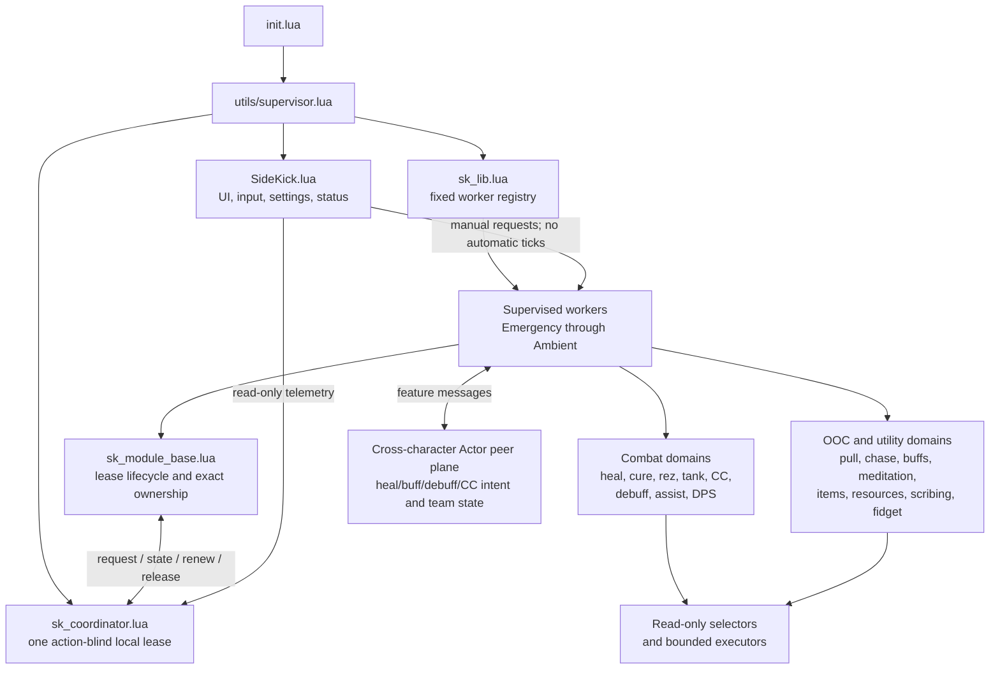
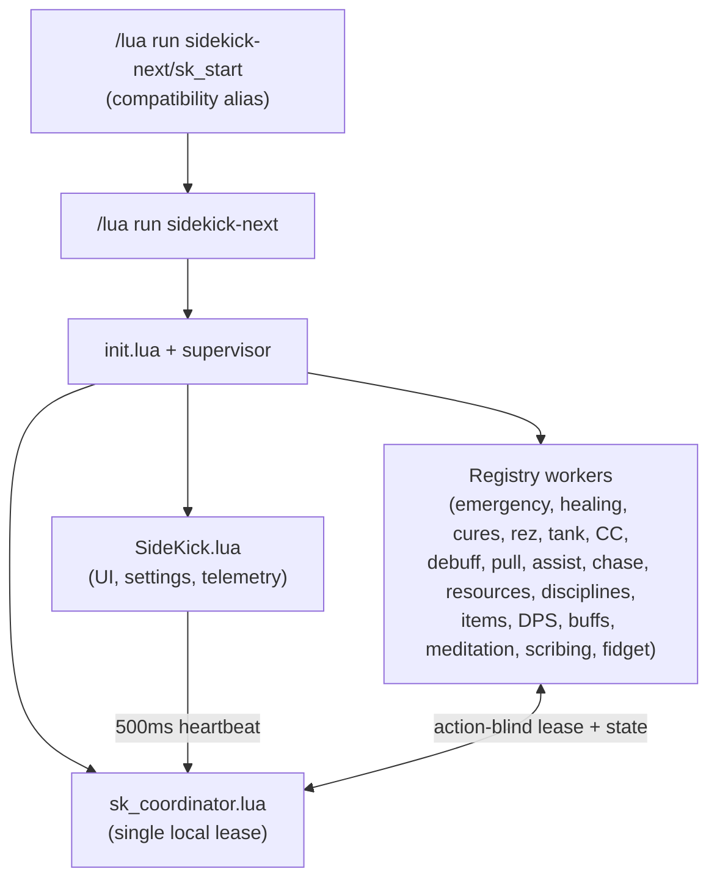
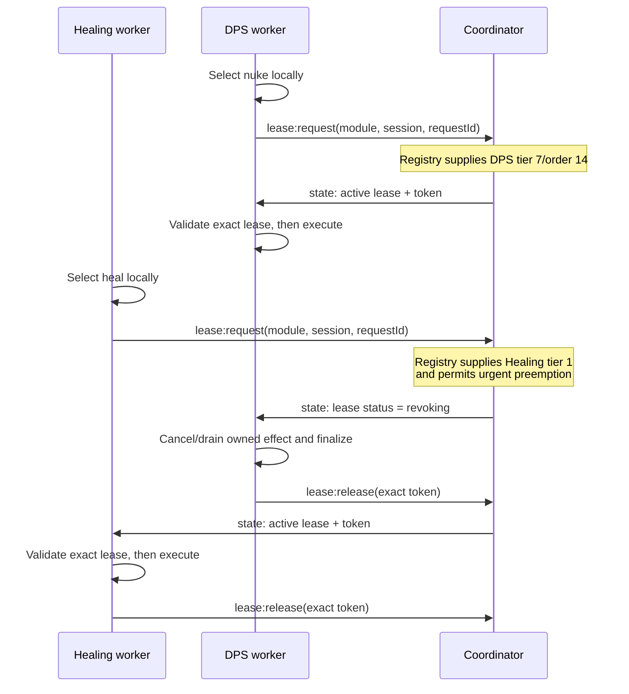
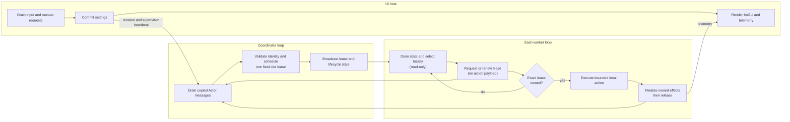
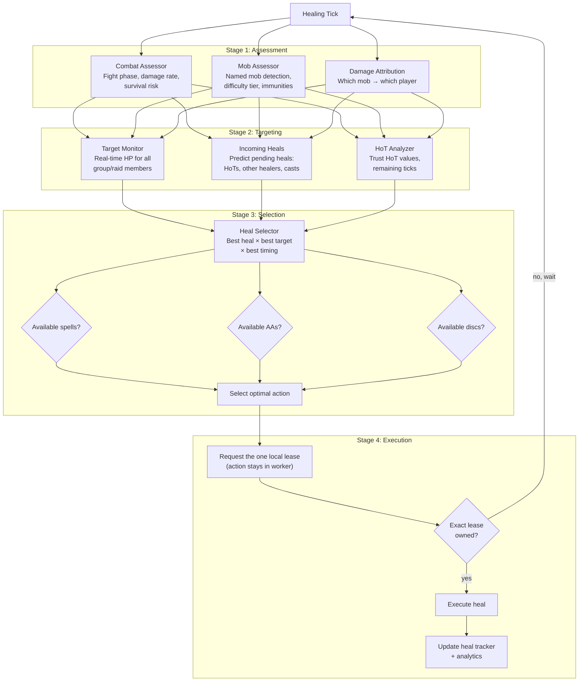
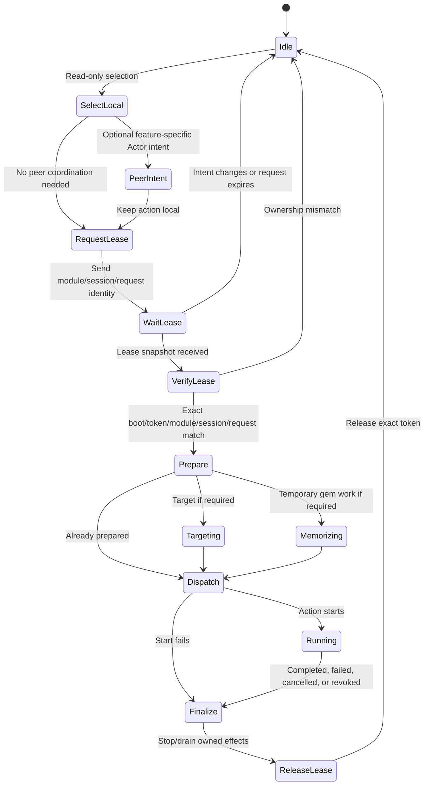
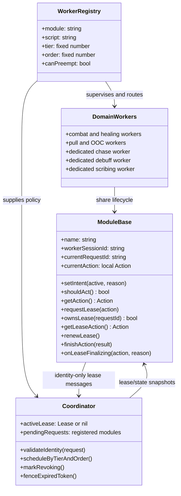
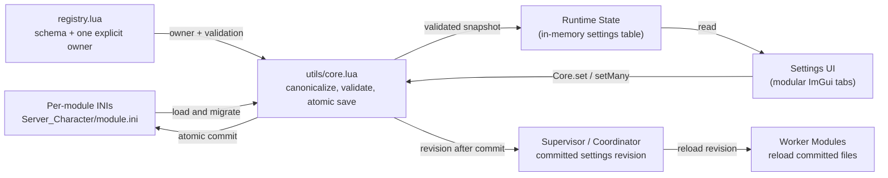

# SideKick-Next User Guide

A comprehensive automation framework for EverQuest via MacroQuest. SideKick provides intelligent class-specific automation, multi-character coordination, and a fully customizable ImGui interface.

**Supported classes:** BER, BRD, CLR, DRU, ENC, MAG, MNK, NEC, PAL, RNG, ROG, SHD, SHM, WAR

---

## Table of Contents

- [Part 1 - User Guide](#part-1---user-guide)
  - [Installation](#installation)
  - [Quick Start](#quick-start)
  - [UI Tour](#ui-tour)
  - [Configuration](#configuration)
  - [Automation Control](#automation-control)
  - [Class-Specific Features](#class-specific-features)
  - [Multi-Box Coordination](#multi-box-coordination)
  - [Commands Reference](#commands-reference)
- [Part 2 - Architecture Guide](#part-2---architecture-guide)
  - [System Overview](#system-overview)
  - [Startup Flow](#startup-flow)
  - [Single-Lease Coordinator](#single-lease-coordinator)
  - [Main Loop](#main-loop)
  - [Healing Intelligence Pipeline](#healing-intelligence-pipeline)
  - [Actors Communication](#actors-communication)
  - [Spell Execution Flow](#spell-execution-flow)
  - [Module Architecture](#module-architecture)
  - [Settings Data Flow](#settings-data-flow)
- [Part 3 - Reference](#part-3---reference)
  - [Settings Reference](#settings-reference)
  - [Priority Tiers](#priority-tiers)
  - [File Map](#file-map)
  - [Glossary](#glossary)

---

# Part 1 - User Guide

## Installation

### Prerequisites

- **MacroQuest** (latest build) with Lua plugin enabled
- **MQ2DanNet** plugin loaded (for cross-character queries)
- **MQ2Nav** plugin recommended (for chase/navigation)

### File Placement

Place the `sidekick-next` folder in your MacroQuest `lua` directory:

```
MacroQuest/
  lua/
    sidekick-next/
      init.lua
      SideKick.lua
      registry.lua
      ...
```

### First Run

Log into EverQuest and type:

```
/lua run sidekick-next
```

The main window and ability bars will appear. Settings are auto-saved to:
```
<MQ Config Dir>/SideKick-Next/config/Server_CharacterName/<module>.ini
```

On the first run after upgrading, SideKick-Next imports the matching production
SideKick configuration into independently persisted module files. The combined
INI remains a read-only migration source. Every registered setting has one
declared module owner, each module file has one writer, and every save retains a
last-known-good `.bak`. On upgrade, settings found in the wrong module file are
moved to their registered owner before the files are combined.

## Quick Start

1. **Launch**: `/lua run sidekick-next` (or `/sidekick` if already running to toggle the window)
2. **Open settings**: `/sidekick settings` or click the cog icon
3. **Pick your theme**: Options > UI > General
4. **Confirm automation is not paused**: turn off the Pause button on the main bar
5. **Enable assist**: Options > Automation > Combat Mode, select `assist`, then choose the assist source
6. **Enable chase**: Options > Automation > Chase, then select MA, MT, Leader, a raid assist, or a named character

That's the minimum to get an automated character following and assisting.

## UI Tour

SideKick renders several ImGui windows, each independently positionable and anchorable.

### Main Bar

The primary ability bar showing your class's AAs, disciplines, and spells as icon buttons.

- **Cooldown overlays**: Grayed-out icons with timer countdown
- **Ready pulse**: Glowing animation when an ability comes off cooldown
- **Click to activate**: Left-click fires the ability
- **Hover tooltip**: Shows ability name, reuse time, and current state
- **Layout**: Configurable rows (1-6), cell size (32-120px), gap, and padding

### Special Bar

Class-specific special abilities displayed separately from the main bar. Berserker disciplines, tank defensives, etc. Supports single-row, single-column, or grid layouts.

### Disc Bar

Discipline-specific bar for melee/tank classes. Shows active and available disciplines with cooldown tracking.

### Item Bar

Clickable items (clicky gear) with cooldown tracking. Configure its contents
under Options > Items and its layout under Options > UI > Item Bar. In
coordinated mode, a click is queued through the item worker and waits for the
one local action lease, so it cannot overlap another worker's cast, movement,
targeting, or item use.

### Skill Bar

Learned combat skills displayed as buttons with readiness and cooldown state. Configure visibility and layout under Options > Buttons > Skills.

### Settings Window

The SideKick Options window contains top-level Buttons, Options, Spell Set,
Healing or Resurrection, Items, and Buffs surfaces. The nested Options surface
contains modular UI, Automation, Resurrection, Integration, Animations,
Humanize, Pull, Remote, Logging, and diagnostic tabs.

The Logging tab controls the general logger for the UI host, coordinator, and
every coordinated worker. Level, file output, and the optional text filter are
persisted and propagated on the next settings revision. Healing Intelligence's
detailed healing log remains a separate file under `HealingLogs`.

### Healing Monitor

Real-time display of the healing intelligence system showing:
- The complete tracked health roster, including full-health characters, with
  current HP%, Max HP, provenance, damage rate, and predicted incoming heals
- Whether each target's Max HP is known (`actor`, `dannet`, `self`, or `spawn`)
  or is using the visibly labeled `ESTIMATED` remote fallback
- Combat assessment (fight phase, damage rate, survival risk)
- Heal efficiency analytics (overhealing %, casts per minute)
- HoT tracking across characters

Open with: `/sidekick healmonitor`

### Aggro Warning

Overlay that flashes when you have aggro above the configured threshold.

## Configuration

Settings are split between top-level feature tabs and the modular tabs inside
Options. Diagnostic tabs appear when their modules load successfully, so the
exact tab count is intentionally not fixed.

### UI Tab

Controls visual appearance and window positioning.

| Setting | Purpose |
|---------|---------|
| Theme | Color scheme: Classic, ClassicEQ, ClassicEQ Textured, Dark, Neon |
| Sync Theme with GT | Match theme to GroupTarget window |
| Manual Move/Resize | Allow dragging windows freely |
| Button Scale | Scale factor for all buttons (0.5x - 3.0x) |
| Font Scale | Scale factor for text (0.5x - 3.0x) |

Ability, Special, Discipline, Item, and Skill bars have dedicated layout controls with:
- **Cell size**: Button dimensions in pixels
- **Rows**: Number of rows in the grid
- **Gap / Padding**: Spacing between and around buttons
- **Background Alpha**: Bar background transparency (0 = invisible, 1 = opaque)
- **Anchor**: Snap to another window (none / left / right / above / below)
- **Anchor Target**: Which window to snap to (most bars default to `grouptarget`; Skill defaults to `none`)
- **Anchor Gap**: Pixel spacing from the anchor target

### Automation Tab

Controls all automated behaviors.

**Chase Section**
| Setting | Default | Purpose |
|---------|---------|---------|
| Enabled | off | Toggle chase automation |
| Role | MA | Who to follow: MA, MT, Leader, Raid1-3, or by name |
| Target | (empty) | Character name if Role = byname |
| Distance | 30 | Units to maintain from chase target |

Chase is owned by a dedicated out-of-combat worker. It selects the destination
without changing game state, then requests the same single action lease used by
every other worker before movement starts. Each movement slice is bounded to
15 seconds. On completion, cancellation, or preemption it stops Nav, MoveTo,
follow/stick, and held movement keys before releasing the lease. Chase is not a
general utility module and it never runs from the UI render loop.

**Combat Mode Section**

`CombatMode` is the single role and enable control. Select `off`, `tank`, or
`assist`; the main-bar Assist button is only a shortcut for this same setting,
not a second persisted gate.

**Assist Settings** (shown when Combat Mode is `assist`)

| Setting | Default | Purpose |
|---------|---------|---------|
| Assist Source | group | Fallback source: group, raid1-3, or byname |
| Assist Name | (empty) | Character name if Assist Source = byname |
| Target Source | coordinated primary | Follow only the published group kill target |
| Engage Condition | hp | Engage by HP threshold or after the tank has aggro |
| Engage HP | 97% | Target HP% to start attacking when using the HP condition |
| Assist Range | 100 | Maximum fallback assist range |

**Tank Settings** (shown when Combat Mode is `tank`)

| Setting | Default | Purpose |
|---------|---------|---------|
| Target Mode | auto | Auto keeps a stable live XTarget; manual preserves the selected NPC |
| AoE Mob Threshold | 3 | Minimum unmezzed haters before an AE hate tool is eligible |
| Require Aggro Deficit | on | Require at least one XTarget below full tank aggro before AE hate |
| Safe AE Check | on | Also suppress AE hate when nearby NPCs are not active XTarget haters; active mez is always protected |
| Moveback Positioning | off | Use tank-facing moveback stick positioning to keep mobs in front |
| Position Refresh | 5s | Refresh cadence for moveback positioning |
| Taunt Chase Range | 60 | Maximum distance for a bounded loose-mob Taunt recovery run |

The tank keeps its primary kill target stable for assisters. A loose mob is a
separate temporary recovery target: the tank may switch to it, approach within
Taunt range, use Taunt or a hate tool, and then restore the primary target.
Mezzed mobs are never selected or hit with automatic AE hate abilities.

**Meditation Section**
| Setting | Default | Purpose |
|---------|---------|---------|
| Mode | off | `off`, `ooc` (out of combat only), or `always` (in and out of combat) |
| HP Start/Stop | 70% / 95% | HP range that triggers sit/stand |
| Mana Start/Stop | 50% / 95% | Mana range that triggers sit/stand |
| End Start/Stop | 60% / 95% | Endurance range that triggers sit/stand |
| Aggro Check | on | Prevent sitting if aggro exceeds threshold |
| Aggro Threshold | 95% | Stand up if aggro exceeds this |
| Post-Combat Delay | 2s | Wait time after combat before sitting |

**Burn Section**
| Setting | Default | Purpose |
|---------|---------|---------|
| Duration | 30s | How long burn mode stays active |

### Healing Tab

For **Clerics, Druids, Shamans, and Paladins**, this opens Healing Intelligence
(see [Healing Intelligence](#healing-intelligence)). The main Healing toggle is
stored as `DoHeals`; pet healing, HoT behavior, heal selection thresholds,
incoming-heal coordination, and analytics are stored in the character's
`healing/config_<Server>_<Character>.lua` file and edited under Advanced Healing
Settings.

The older `MainHealPoint`, `BigHealPoint`, `GroupHealPoint`, `GroupInjureCnt`,
`HealUseHoTs`, and `HealCoordinateActors` registry keys remain only for
compatibility with the retired tiered healer. They are not the active controls
when Healing Intelligence is available.

### Resurrection

Rez-capable classes (CLR, DRU, SHM, PAL, and NEC) have resurrection settings
under **Options > Resurrection**. Healer classes can also reach the same
controls near the bottom of **Healing > Settings**. NEC receives the dedicated
resurrection surface without loading Healing Intelligence.

OOC and combat behavior are configured separately:

| Setting | Default | Purpose |
|---|---:|---|
| Auto-Rez Out of Combat | on | Enable group and Actor Team corpse rez after combat |
| OOC Method | Auto | Auto, Spell, or configured Item |
| Auto-Rez In Combat | off | Allow combat rez attempts |
| Combat Method | Auto | Auto, AA, already-memorized Spell, or Item |
| Combat Target Classes | All | Restrict combat rez to selected classes |
| Rez Item Name | empty | Exact inventory item name to use for Item/Auto |
| Auto-Memorize OOC Rez Spell | on | Temporarily memorize the best learned rez spell |
| Temporary Gem | 0 | Gem used for rez; zero means the final gem |
| Restore Replaced Gem | on | Restore the prior gem after the attempt or restart |
| Coordinate via Actors | on | Elect one rezzer per corpse |
| Rezzer Priority | 50 | Lower number wins; name breaks exact ties |
| Navigate to OOC Corpses | off | Use MQ2Nav for an out-of-range corpse |

Auto mode prefers a configured, ready item. In combat it then tries the
class battle-rez AA and an already-memorized spell. Out of combat it falls
back to the best learned spell and may memorize it on demand. SideKick never
auto-memorizes or starts corpse navigation during combat.

Before entering Actor election or requesting the local action lease, the worker
checks the corpse against the selected spell/item/AA range. An out-of-range
corpse is ignored unless OOC navigation is enabled and the corpse is within the
configured navigation limit.

The worker prefers group-member corpses, then checks fresh peers from the current
Actor Team for an exact PC corpse visible in the rezzer's zone. That corpse is
authoritative even if the peer's Actor death flag is late or the player has
released to a bind point in another zone. This supports raid-group and
manual-team OOG resurrection without treating every visible player corpse as
eligible. Its Actor intent is short-lived and deterministic, so a failed or
disconnected primary rezzer automatically yields to the next eligible character.

### Buffs Tab

Configure out-of-combat buff automation and each spell's condition and target.
Pet-only buffs are controlled by their spell profiles; there is no global
pet-buff switch. Cross-character Actor claims prevent duplicate peer work;
those messages are separate from the coordinator's one local action lease.

### Spell Sets and Manual Memorization

When SideKick is idle and out of combat, a manual gem change is adopted into
the active spell set shortly after the spellbook closes. SideKick saves the new
layout instead of restoring the old gem on the former 30-second watchdog.
Manual gem observation does not authorize automatic gameplay. Automatic
spell-gem and scribing work runs in the dedicated scribing worker and waits for
the one local action lease.

Automation settings are archived by spell ID. If a configured spell is removed
and later memorized manually or dragged back into any combat gem, its condition,
priority, buff target, and utility flags are restored. A spell that has never
been configured receives the normal generated defaults.

Spell-set saves are staged and validated before replacing the live file. The
previous valid file is retained as a `.bak` recovery copy.

Manual gem adoption detects and displays each spell's functional type. A
beneficial spell such as Invisibility remains in its physical gem slot but is
excluded from the DPS worker. Enable it under OOC Buffs if SideKick should
maintain it automatically; merely memorizing a buff does not opt it into
automatic recasting.

If the set has OOC buffs, the final gem remains reserved for buff hot-swapping;
manual changes to that reserved gem are intentionally not adopted.

### Items Tab

Select which clickable items appear in the Item Bar. Each slot can be On Demand,
Combat (optionally below an HP threshold), Out of Combat, or On Condition. The
automatic modes and manual bar clicks use the same coordinated item worker.
Saved conditions stay attached to the slot in the item module config.

### Integration Tab

| Setting | Default | Purpose |
|---------|---------|---------|
| Actors Enabled | on | Publish UI peer/status data and expose Actor integration controls |
| Enable Team Presence | on | Publish coordinator presence to the current Actor team |
| Team Mode | auto | Choose raid, group, solo, or a shared manual team |
| Team Name | empty | Case-insensitive team name used only in manual mode |

In coordinated mode, the local coordinator/worker Actor transport remains
active even if Actors Enabled is switched off. Use the feature-specific
coordination settings, such as resurrection coordination, to control those
behaviors. Actor Team presence has its own Enable Team Presence switch.

### Animations Tab

Toggle individual UI animation effects:
| Animation | Default | Description |
|-----------|---------|-------------|
| Hover Scale | on | Buttons grow slightly when hovered |
| Click Bounce | on | Buttons bounce when clicked |
| Toggle Pop | on | Pop animation when toggling abilities |
| Ready Pulse | on | Glow when ability comes off cooldown |
| Cooldown Color Tween | on | Smooth color transition during cooldowns |
| Toggle Color Tween | on | Smooth color on toggle state change |
| Stagger Animation | on | Buttons appear one-by-one on load |
| Low Resource Warning | on | Glow effect when HP/mana is low |
| Damage Flash | on | Flash effect when taking damage |

## Automation Control

Coordinated mode uses explicit feature settings: Assist, Chase, Healing, Cures,
Buffing, Mezzing, Resurrection, Pull, and the relevant spell/AA/disc toggles.
The Pause button, `/sk pause`, and `/sk resume` control the global
`AutomationPaused` setting and apply to every coordinated worker.

`AutomationLevel` (`manual`/`hybrid`/`auto`) is read by the coordinated
workers to gate cast vs. movement actions. Its historical UI presence is
intentionally hidden — the Pause button and per-domain toggles in the
Automation tab are the user-facing knobs.

Pull runs in its own coordinated worker. The Pull tab or `/sk_pull start` saves
the configuration through the main SideKick process. Candidate scanning remains
read-only; the character will not stand, navigate, retarget, attack, or fire
the selected pull ability until the worker holds the single action lease.
`/sk_pull status`, `camp`, `pulltarget`, and `clearignore` are forwarded to
that worker.

Pull was mechanically migrated to the lease lifecycle but was not redesigned.
Its candidate selection, election, pathing, state-machine strategy, and tuning
remain intentionally deferred while the core coordination path is stabilized.

Idle Humanize fidgets also run under a supervised worker in coordinated mode.
They remain disabled by the Humanize/fidget toggles and are suppressed while
combat, navigation, casting, group combat, nearby mez, or chat input makes a
synthetic keypress unsafe.

## Class-Specific Features

### Healing Intelligence

CLR, DRU, SHM, and PAL characters use a dedicated healing intelligence subsystem with 15 specialized modules:

- **Combat Assessor**: Evaluates fight phase (opening, sustained, critical), damage rate, and survival risk
- **Target Monitor**: Real-time HP tracking for all group/raid members
- **Incoming Heals**: Predicts incoming heals from HoTs, other healers, and pending casts
- **Mob Assessor**: Identifies named mobs, difficulty tiers, and spell immunity
- **Heal Selector**: Picks the optimal heal (spell, AA, or disc) for the optimal target at the optimal time
- **Damage Attribution**: Tracks which mob is damaging which player
- **Analytics**: Efficiency metrics (overhealing %, casts per minute, mana efficiency)

Emergency abilities (Divine Arbitration, Celestial Regen, Sanctuary) trigger automatically when multiple members reach critical HP.

When you memorize a new healing spell, run `/sk_healing rescan` to merge it
into the current character's healing profile. Existing assignments are kept;
the same non-destructive merge also runs when the healing worker starts.

### Tank Classes (WAR, PAL, SHD)

- **Stable kill target**: The Actor team receives a refreshed primary target while loose-mob recovery remains temporary
- **Aggro recovery**: Bounded Taunt chase and class hate tools run before normal engagement work
- **Defensive ordering**: Emergency and defensive abilities use explicit class safety order instead of alphabetical selection
- **AoE safety**: Configurable mob/aggro thresholds; mez protection is unconditional and the extended check rejects nearby neutral NPCs
- **Moveback positioning**: Optional RG-style stick positioning with a configurable refresh cooldown

### Crowd Control (ENC, BRD, NEC)

- **Auto-Mez**: Mez targets on XTarget up to configurable max
- **AoE Mez**: Triggers when mob count exceeds threshold
- **Fast Mez**: Prioritize quick-casting mez spells
- **Refresh Window**: Re-mez before it drops (default: 6s before expiry)
- **Actor Coordination**: Prevents double-mezzing across characters

### Debuffers (SHM, ENC, MAG)

- **Class profiles**: Determine the supported slow, malo/tash, and cripple lines
- **Task Mob Debuffing**: Apply debuffs to all task mobs
- **Actor Coordination**: Prevents duplicate debuffs across characters

Automatic debuff selection and execution runs in its own fixed Debuff-tier
worker. The DPS worker does not also execute debuff entries.

### Melee DPS (BER, MNK, ROG, RNG)

- **Discipline Bar**: Visual display of available discs with cooldowns
- **Burn Mode**: Timed burst DPS toggle
- **Stick Command**: Configurable positioning (`/stick snaproll behind 10 moveback uw`)
- **Dragon Positioning**: Angle-based positioning for large hitbox mobs

### Casters (MAG, NEC, WIZ, DRU)

- **Spell Rotation**: Cycle through configured spells by priority
- **Resist Type Preference**: Target specific resist types
- **Escape Range**: Back away from mobs when too close
- **Interrupt on Emergency**: Stop casting if self-HP drops critically low

## Multi-Box Coordination

SideKick uses the **Actors** messaging system for real-time inter-character communication. No external tools needed beyond MacroQuest's built-in Actors.
The claims below are short-lived peer intents used to avoid duplicate work
across characters. They are distinct from each character's action-blind local
lease and cannot authorize gameplay on their own.

### What Gets Coordinated

| Data | Purpose |
|------|---------|
| Heal claims | Prevents two healers targeting the same player |
| HoT tracking | Tracks heal-over-time effects across all healers |
| Buff status | Prevents duplicate buffing |
| Debuff claims | Prevents duplicate slows/tashs/malos |
| Mez claims | Prevents double-mezzing |
| Target updates | Shares current target for assist chains |
| Tank broadcasts | Tank announces primary target to all assisters |
| Window bounds | Share window positions for UI anchoring |
| Team presence | Share coordinator state, active lease holder/phase, role, and module readiness |

The generic Actors peer count and Actor Team peer count are different. Generic
peers are every live SideKick status sender visible through Actors. Actor Team
peers share the same trusted raid, group, or manual team identity and are the
only OOG peers eligible for automated resurrection.

### Setup

1. Leave Options > Integration > Actors Enabled on to publish UI status and expose the team controls
2. Leave Enable Team Presence on and Team Mode on `auto`, or give every intended character the same manual team name
3. Run SideKick on each character
4. Open Coordinator > Actor Team or use `/sk_coord team` to verify membership and leader election

Auto mode groups characters by raid leader, then group leader, and uses a solo
team when ungrouped. Team peers expire four seconds after their coordinator
stops responding. Team presence is currently diagnostic infrastructure;
feature-specific heal, rez, cure, buff, and CC coordination continues to work
through its existing Actor messages.

### Safe Targeting (KS Prevention)

SideKick checks targets against raid members and actor peers before engaging, preventing accidental kill stealing. Configure in Settings:

| Setting | Default | Purpose |
|---------|---------|---------|
| Safe Targeting | on | Check before engaging new targets |
| Check Raid | on | Verify against raid member targets |
| Check Peers | on | Verify against actor peer targets |

## Commands Reference

### Main Command

`/sidekick [subcommand]` or `/SideKick [subcommand]`

| Subcommand | Action |
|------------|--------|
| *(none)* | Toggle main window |
| `settings` / `options` / `config` | Toggle settings panel |
| `config audit` | Validate the registry and report unknown/invalid settings |
| `config get <key>` | Show a setting's value, owner, registration type, and file |
| `config set <key> <value>` | Validate and save a setting through its registered owner |
| `bar` | Toggle ability bar |
| `burn` | Activate burn mode |
| `burnoff` | Deactivate burn mode |
| `chase` | Toggle chase |
| `assist` | Toggle assist |
| `remote` | Toggle remote ability bar |
| `remoteconfig` | Open remote abilities settings |
| `healmonitor` | Toggle healing monitor (CLR/DRU/SHM/PAL) |
| `spellset` / `ss` | Open spell set editor |
| `assistme` | Broadcast assist request to peers |

### Shortcut Commands

| Command | Action |
|---------|--------|
| `/skchaseon` | Enable chase (broadcastable with `/dgge`) |
| `/skchaseoff` | Disable chase (broadcastable with `/dgge`) |
| `/skassistme` | Broadcast assist request |
| `/skactors` | Toggle actors debug window |
| `/sk_assist status\|stop` | Inspect the coordinated melee-assist target, lease owner, fixed tier, and last decision |
| `/sk_tank status\|stop` | Inspect the tank primary target, pending action, coordinator lease, hater/deficit counts, and last action |
| `/sk_items status\|list\|stop` | Inspect queued/manual item work, list each configured clicky's eligibility, or stop the coordinated item worker |
| `/skspells [sub]` | Spellbook scanner commands |
| `/skcd [on\|off\|clear\|debug]` | Cooldown debugging |
| `/sk_next_meditation off\|ooc\|always\|status\|reload\|audit\|stop` | Set, control, and diagnose the SideKick-Next meditation worker without colliding with production SideKick |
| `/sk_buffs status\|reload\|retry\|dump\|clearcache\|debug on\|debug off\|stop` | Diagnose the buff worker; debug mode mirrors its throttled action trace to the MQ console, while failures always echo |
| `/sk_rez status\|debug on\|off\|retry\|now [name]\|stop` | Inspect or control the resurrection worker; status includes each Actor Team member's corpse-scan result, and `now` requests a group or Actor Team member rez while bypassing the automatic enable/class gates for that attempt |
| `/sk_coord team` | Show Actor team mode, identity, elected leader, and live member count |

### Debug Commands

| Command | Action |
|---------|--------|
| `/sidekick debugsettings [on\|off]` | Log settings persistence events |
| `/sidekick actorsdebug` | Open actors debug window |
| `/sidekick coord` | Open coordinator debug window |
| `/sidekick debugcombat gems` | Show spell gems and their types |
| `/sidekick debugcombat state` | Show combat state and target info |
| `/sidekick debugcombat list` | Show castable spells (non-heal) |
| `/skloglevel 1-5` | Set and persist the general log level for the UI, coordinator, and workers |
| `/sklogfilter text\|clear` | Restrict general logs to matching module/message text, or clear the filter |
| `/sklogfile on\|off` | Enable or disable the shared general log file across SideKick processes |
| `/sidekick debugooc` | Reports that the legacy executor is retired; use `/sk coordinator` |

---

# Part 2 - Architecture Guide

## System Overview

SideKick uses a supervised fleet of independent workers and one local,
action-blind coordinator. Every automatic game-changing episode passes through
the same lease, regardless of whether it casts, targets, moves, attacks, clicks
an item, sits, or changes a spell gem.


```mermaid
graph TB
    INIT["init.lua"] --> SUP["utils/supervisor.lua"]
    SUP --> UI["SideKick.lua<br/>UI, input, settings, status"]
    SUP --> COORD["sk_coordinator.lua<br/>one action-blind local lease"]
    SUP --> REG["sk_lib.lua<br/>fixed worker registry"]
    REG --> WORKERS["Supervised workers<br/>Emergency through Ambient"]
    WORKERS --> BASE["sk_module_base.lua<br/>lease lifecycle and exact ownership"]
    BASE <-->|"request / state / renew / release"| COORD

    WORKERS --> COMBAT["Combat domains<br/>heal, cure, rez, tank, CC,<br/>debuff, assist, DPS"]
    WORKERS --> OOC["OOC and utility domains<br/>pull, chase, buffs, meditation,<br/>items, resources, scribing, fidget"]
    COMBAT --> HELPERS["Read-only selectors<br/>and bounded executors"]
    OOC --> HELPERS

    UI -->|"manual requests; no automatic ticks"| WORKERS
    UI -->|"read-only telemetry"| COORD

    PEERS["Cross-character Actor peer plane<br/>heal/buff/debuff/CC intent and team state"]
    WORKERS <-->|"feature messages"| PEERS
```

The coordinator never receives a worker's action or a caller-selected priority.
It knows only registered worker identity, request/lease identity, fixed tier and
order, readiness, and lifecycle state. The selected action stays inside its
worker until exact lease ownership is validated.

## Startup Flow

SideKick uses one canonical coordinated launch mode. The legacy `sk_start`
entry point is retained as an alias and forwards to `/lua run sidekick-next`.


```mermaid
flowchart TD
    USER["/lua run sidekick-next"]
    USER2["/lua run sidekick-next/sk_start<br/>(compatibility alias)"]
    INIT["init.lua + supervisor"]
    COORD["sk_coordinator.lua<br/>(single local lease)"]
    UI["SideKick.lua<br/>(UI, settings, telemetry)"]
    WORKERS["Registry workers<br/>(emergency, healing, cures, rez, tank, CC,<br/>debuff, pull, assist, chase, resources, disciplines,<br/>items, DPS, buffs, meditation, scribing, fidget)"]

    USER --> INIT
    USER2 --> USER
    INIT --> COORD
    INIT --> WORKERS
    INIT --> UI
    UI -->|"500ms heartbeat"| COORD
    WORKERS <-->|"action-blind lease + state"| COORD
```

The UI process supervises the session. Normal shutdown stops every managed
worker and the coordinator; loss of the UI heartbeat also causes the
coordinator and workers to shut down. Automatic casting, targeting, movement,
item use, meditation, and scribing belong to leased workers. The UI process
remains responsible for presentation, configuration, manual request submission,
cached state, and cross-character status.

## Single-Lease Coordinator

The coordinator grants one local lease at a time and does not discriminate by
action type. A cast, target change, movement run, item click, attack, sit/stand,
or spell-gem change all use the same lease. The worker chooses and keeps the
action locally; its request sends identity and request data only.

Scheduling policy comes from the worker registry in `sk_lib.lua`. Each worker
has one fixed tier and one deterministic order within that tier. A worker
cannot select or transmit its scheduling priority, and simultaneous requests
in the same tier are ordered by the registry rather than arrival timing.

After a lease is granted, the unified action executor shows supported actions
moving through queued, dispatching, cast-start, running, and terminal phases.
These phases appear in Coordinator > Module Status. Hover the Action cell to
see the terminal reason and elapsed time. Incapacitation, stale state, a failed
start, cancellation, or revocation sends the holder through its own finalizer
before the exact lease is released.


```mermaid
sequenceDiagram
    participant H as Healing worker
    participant D as DPS worker
    participant C as Coordinator

    D->>D: Select nuke locally
    D->>C: lease:request(module, session, requestId)
    Note over C: Registry supplies DPS tier 7/order 14
    C->>D: state: active lease + token
    D->>D: Validate exact lease, then execute

    H->>H: Select heal locally
    H->>C: lease:request(module, session, requestId)
    Note over C: Registry supplies Healing tier 1<br/>and permits urgent preemption
    C->>D: state: lease status = revoking
    D->>D: Cancel/drain owned effect and finalize
    D->>C: lease:release(exact token)
    C->>H: state: active lease + token
    H->>H: Validate exact lease, then execute
    H->>C: lease:release(exact token)
```

Urgent preemption is controlled by **Allow Urgent Lease Preemption**
(`LeasePreemptionEnabled`). Only Emergency, Healing, Cures, Resurrection, and
Tank are registered as urgent candidates, and only when the candidate's tier
number is lower than the current holder's. The coordinator marks the lease
`revoking`; it never sends a gameplay command such as `/stopcast`. The current
holder cleans up effects it owns before release. If it misses the grace period
or TTL, the old token is fenced and a recovery lease runs before new work.

## Main Loop

There is no single automation loop. The UI host, coordinator, and each worker
yield and advance independently.


```mermaid
flowchart LR
    subgraph "UI host"
        UIINPUT["Drain input and manual requests"]
        UISET["Commit settings"]
        UIRENDER["Render ImGui and telemetry"]
        UIINPUT --> UISET --> UIRENDER
    end

    subgraph "Coordinator loop"
        MSG["Drain copied Actor messages"]
        SCHED["Validate identity and schedule<br/>one fixed-tier lease"]
        STATE["Broadcast lease and lifecycle state"]
        MSG --> SCHED --> STATE
    end

    subgraph "Each worker loop"
        SENSE["Drain state and select locally<br/>(read-only)"]
        REQUEST["Request or renew lease<br/>(no action payload)"]
        OWN{"Exact lease<br/>owned?"}
        EXEC["Execute bounded local action"]
        CLEAN["Finalize owned effects<br/>then release"]
        SENSE --> REQUEST --> OWN
        OWN -->|yes| EXEC --> CLEAN
        OWN -->|no| SENSE
    end

    UISET -->|"revision and supervisor heartbeat"| MSG
    REQUEST --> MSG
    STATE --> SENSE
    CLEAN --> MSG
    CLEAN -->|"telemetry"| UIRENDER
```

The UI loop renders and submits requests; it does not run automatic gameplay
subsystems. Combat debuffing, out-of-combat Chase, and automatic spell
scribing/gem work have separate `sk_debuff.lua`, `sk_chase.lua`, and
`sk_scribing.lua` workers rather than falling through a shared utility loop.

## Healing Intelligence Pipeline

The healing intelligence system uses a multi-stage pipeline to select the optimal heal.


```mermaid
flowchart TD
    TICK["Healing Tick"]

    subgraph "Stage 1: Assessment"
        CA["Combat Assessor<br/>Fight phase, damage rate,<br/>survival risk"]
        MA["Mob Assessor<br/>Named mob detection,<br/>difficulty tier, immunities"]
        DA["Damage Attribution<br/>Which mob → which player"]
    end

    subgraph "Stage 2: Targeting"
        TM["Target Monitor<br/>Real-time HP for all<br/>group/raid members"]
        IH["Incoming Heals<br/>Predict pending heals:<br/>HoTs, other healers, casts"]
        HA["HoT Analyzer<br/>Trust HoT values,<br/>remaining ticks"]
    end

    subgraph "Stage 3: Selection"
        HS["Heal Selector<br/>Best heal × best target<br/>× best timing"]
        SPELLS{"Available spells?"}
        AA{"Available AAs?"}
        DISC{"Available discs?"}
        PICK["Select optimal action"]
    end

    subgraph "Stage 4: Execution"
        LEASE["Request the one local lease<br/>(action stays in worker)"]
        GRANTED{"Exact lease<br/>owned?"}
        CAST["Execute heal"]
        TRACK["Update heal tracker<br/>+ analytics"]
    end

    TICK --> CA & MA & DA
    CA & MA & DA --> TM & IH & HA
    TM & IH & HA --> HS
    HS --> SPELLS & AA & DISC
    SPELLS & AA & DISC --> PICK
    PICK --> LEASE --> GRANTED
    GRANTED -->|yes| CAST --> TRACK
    GRANTED -->|no, wait| TICK
```

### How Heal Selector Decides

The heal selector separates routine efficiency from catch-up healing:

1. **Urgency**: How close is the target to death? (HP%, damage rate, incoming damage)
2. **Stable efficiency**: Routine direct heals maximize effective healing per
   mana after projected overheal. Fast direct heals and Complete Heal are
   excluded from this comparison.
3. **Group value**: A direct group heal must first meet the configured wounded
   member threshold (normally three, or two during detected AE damage). Its
   effective healing across the full local group is then compared on the same
   effective-healing-per-mana scale as the best stable single-target direct
   heal. Pending heals and trusted incoming HoT coverage reduce useful healing.
   The group heal only wins when it is more efficient; a target that needs
   high-DPS catch-up keeps the decision on the single-target fast-heal path.
4. **Catch-up speed**: A fast heal is eligible below the emergency threshold,
   or during high measured pressure when the efficient heal would land below
   the emergency floor or incoming damage would erase its healing.
5. **Coordination**: Is another healer already targeting this player? (via Actor claims)

An estimated Max HP no longer forces the smallest heal. The estimated deficit
and measured damage rate go through the same stable/catch-up policy, while the
Healing Monitor exposes the estimate and its source.

## Actors Communication

Cross-character messaging uses MacroQuest's Actors system (mailbox-based message passing).
Feature messages such as `heal:claim`, `buff:claim`, `debuff:claim`, and
`cc:claim` coordinate intent between characters; they do not grant execution
rights. Each character's separate local control plane still requires that
character's one coordinator lease before any game-changing action.

```mermaid
sequenceDiagram
    participant C1 as Character 1<br/>(Cleric)
    participant MB as Actors Mailbox<br/>"sidekick"
    participant C2 as Character 2<br/>(Shaman)
    participant C3 as Character 3<br/>(Warrior)

    Note over MB: All characters register<br/>on "sidekick" mailbox

    C3->>MB: target:primary<br/>{targetName: "a_gnoll_01", targetId: 42}
    MB->>C1: target:primary
    MB->>C2: target:primary
    Note over C1,C2: Both pin the group kill target;<br/>the tank's temporary peel target is private

    C1->>MB: heal:claim<br/>{target: "Warrior", spell: "Complete Heal"}
    MB->>C2: heal:claim
    Note over C2: Warrior already claimed<br/>→ heal someone else

    C2->>MB: heal:hots<br/>{target: "Warrior", spell: "Regeneration", ticks: 12}
    MB->>C1: heal:hots
    Note over C1: Factor HoT into<br/>incoming heal prediction

    C1->>MB: buff:list<br/>{buffs: ["Symbol of Naltron", "Aegolism"]}
    MB->>C2: buff:list
    Note over C2: Skip duplicate buffs
```

### Message Types

| Message | Direction | Purpose |
|---------|-----------|---------|
| `status:req` / `status:rep` | Request/Reply | Health and status queries |
| `team:state` / `team:leave` | Broadcast | Versioned coordinator presence for the current Actor team |
| `heal:claim` | Broadcast | "I'm healing this target" |
| `heal:hots` | Broadcast | "I applied or am maintaining these HoTs" |
| `buff:list` / `buff:claim` / `buff:landed` | Broadcast | Buff availability, intent, and completion |
| `target:primary` | Broadcast | Authoritative group kill target; fresh ID 0 means do not acquire |
| `debuff:claim` | Broadcast | "I'm debuffing this mob" |
| `cc:claim` | Broadcast | "I'm mezzing this mob" |
| `window:bounds:req` / `window:bounds` | Request/Reply | UI window position sharing |

## Spell Execution Flow

The selected spell remains local, and all mutations — including temporary gem
work — occur only inside the one action lease.


```mermaid
stateDiagram-v2
    [*] --> Idle
    Idle --> SelectLocal: Read-only selection
    SelectLocal --> PeerIntent: Optional feature-specific Actor intent
    SelectLocal --> RequestLease: No peer coordination needed
    PeerIntent --> RequestLease: Keep action local
    RequestLease --> WaitLease: Send module/session/request identity
    WaitLease --> VerifyLease: Lease snapshot received
    WaitLease --> Idle: Intent changes or request expires
    VerifyLease --> Prepare: Exact boot/token/module/session/request match
    VerifyLease --> Idle: Ownership mismatch

    Prepare --> Targeting: Target if required
    Prepare --> Memorizing: Temporary gem work if required
    Prepare --> Dispatch: Already prepared
    Targeting --> Dispatch
    Memorizing --> Dispatch

    Dispatch --> Running: Action starts
    Dispatch --> Finalize: Start fails
    Running --> Finalize: Completed, failed, cancelled, or revoked
    Finalize --> ReleaseLease: Stop/drain owned effects
    ReleaseLease --> Idle: Release exact token
```

The optional peer intent is coordination between characters, not local
scheduling authority. Long multi-phase workflows renew their lease. If a
worker exits with dirty effects or a token is fenced, its recovery lease cleans
those effects before the coordinator admits ordinary work.

## Module Architecture

All supervised workers use `ModuleBase` for the same lease lifecycle. Domain
code decides what to do; scheduler policy stays in the registry/coordinator.


```mermaid
classDiagram
    class ModuleBase {
        +name: string
        +workerSessionId: string
        +currentRequestId: string
        +currentAction: local Action
        +setIntent(active, reason)
        +shouldAct() bool
        +getAction() Action
        +requestLease(action)
        +ownsLease(requestId) bool
        +getLeaseAction() Action
        +renewLease()
        +finishAction(result)
        +onLeaseFinalizing(action, reason)
    }

    class WorkerRegistry {
        +module: string
        +script: string
        +tier: fixed number
        +order: fixed number
        +canPreempt: bool
    }

    class Coordinator {
        +activeLease: Lease or nil
        +pendingRequests: registered modules
        +validateIdentity(request)
        +scheduleByTierAndOrder()
        +markRevoking()
        +fenceExpiredToken()
    }

    class DomainWorkers {
        +combat and healing workers
        +pull and OOC workers
        +dedicated chase worker
        +dedicated debuff worker
        +dedicated scribing worker
    }

    DomainWorkers --> ModuleBase : share lifecycle
    WorkerRegistry --> Coordinator : supplies policy
    WorkerRegistry --> DomainWorkers : supervises and routes
    ModuleBase --> Coordinator : identity-only lease messages
    Coordinator --> ModuleBase : lease/state snapshots
```

The exact ownership check includes coordinator boot ID, token, holder module,
worker session, and request ID. No `Action` crosses the ModuleBase-to-coordinator
arrow.

## Settings Data Flow

How settings move from file to UI and back.


```mermaid
flowchart LR
    INI["Per-module INIs<br/>Server_Character/module.ini"]
    REG["registry.lua<br/>schema + one explicit owner"]
    CORE["utils/core.lua<br/>canonicalize, validate, atomic save"]
    RUNTIME["Runtime State<br/>(in-memory settings table)"]
    UI["Settings UI<br/>(modular ImGui tabs)"]
    COORD["Supervisor / Coordinator<br/>committed settings revision"]
    MODULES["Worker Modules<br/>reload committed files"]

    REG -->|"owner + validation"| CORE
    INI -->|"load and migrate"| CORE
    CORE -->|"validated snapshot"| RUNTIME
    RUNTIME -->|"read"| UI
    UI -->|"Core.set / setMany"| CORE
    CORE -->|"atomic commit"| INI
    CORE -->|"revision after commit"| COORD
    COORD -->|"reload revision"| MODULES
```

**Key behavior**: UI changes update the local runtime immediately, then publish
a new revision only after the owning module INI commits successfully. Workers
reload that committed revision without requiring a Lua restart.

---

# Part 3 - Reference

## Settings Reference

### UI Settings

| Key | Type | Default | Description |
|-----|------|---------|-------------|
| SideKickTheme | text | Classic | Active color theme |
| SideKickSyncThemeWithGT | bool | true | Sync theme with GroupTarget |
| SideKickMainEnabled | bool | false | Show main bar window |
| SideKickOptionsManual | bool | true | Allow manual window move/resize |
| SideKickMainAnchor | text | none | Main bar anchor mode |
| SideKickMainButtonScale | float | 1.0 | Button size scale (0.5-3.0) |
| SideKickFontScale | float | 1.0 | Font size scale (0.5-3.0) |

### Bar Settings (Ability / Special / Discipline / Item / Skill)

Bar keys use the prefixes `SideKickBar`, `SideKickSpecial`,
`SideKickDiscBar`, `SideKickItemBar`, and `SideKickSkillBar`. The common
suffixes are:

| Suffix | Type | Default | Description |
|--------|------|---------|-------------|
| Enabled | bool | true | Show this bar |
| Cell | int | 40-65 | Button size in pixels; default depends on the bar |
| Rows | int | 1-2 | Number of rows; default depends on the bar |
| Gap | int | 4 | Gap between buttons |
| Pad | int | 6 | Padding inside bar |
| BgAlpha | float | 0.85 | Background opacity (0-1) |
| Anchor | text | none | Anchor mode |
| AnchorTarget | text | varies | GroupTarget for most bars; none for the Skill Bar |
| AnchorGap | int | 2 | Spacing from anchor (0-48) |

### Combat Settings

| Key | Type | Default | Description |
|-----|------|---------|-------------|
| CombatMode | text | off | Combat role (off/tank/assist) |
| StickCommand | text | /stick snaproll... | Melee positioning command |
| DragonPositioning | bool | false | Dragon fight positioning |
| EmergencyHpThreshold | int | 35 | Emergency HP% |
| UseSpells | bool | true | Enable spell usage |
| UseAAs | bool | true | Enable AA usage |
| UseDiscs | bool | true | Enable disc usage |
| SpellRotationEnabled | bool | false | Enable spell rotation |
| SpellAutoMemorize | bool | true | Auto-memorize spells |
| InterruptOnTargetDeath | bool | true | Stop cast if target dies |

### Automation Settings

| Key | Type | Default | Description |
|-----|------|---------|-------------|
| AutomationLevel | text | auto | Play style (`manual` / `hybrid` / `auto`) — controls cast vs. movement gating |
| AutomationPaused | bool | false | Global pause |
| LeasePreemptionEnabled | bool | true | Allow registered urgent workers to revoke a lower-tier local lease |
| ChaseEnabled | bool | false | Chase toggle |
| ChaseRole | text | ma | Chase target role |
| ChaseDistance | int | 30 | Chase distance |
| AssistMode | text | group | Assist source (`group`, raid assist, or `byname`) |
| AssistName | text | empty | Required OOG main-assist character when AssistMode is `byname` |
| AssistAt | int | 97 | Engage HP% |
| MeditationMode | text | off | off/ooc/always |
| BurnDuration | int | 30 | Burn duration (seconds) |
| BuffingEnabled | bool | true | Buff automation |

An Actor Team leader is elected only to give the team a stable coordination
identity; it is not automatically the combat main assist. For an OOG main
assist, select **Assist Source: By Name** and enter that SideKick character's
name. DPS ignores the healer's own Actor Team target when voting, prefers the
configured main assist or a member in `tank` combat mode, and otherwise uses
fresh same-zone remote NPC targets. Remote `inCombat` state is accepted as
engagement evidence because an OOG healer may not receive the same XTarget
hater slot.

### Current Healing and Cure Settings

| Key | Type | Default | Description |
|-----|------|---------|-------------|
| DoHeals | bool | true | Enable Healing Intelligence |
| DoCures | bool | true | Cure automation |
| CurePrioritySelf | bool | false | Cure self before other valid targets |
| CureInCombat | bool | true | Allow cures during combat |

Healing Intelligence stores pet, HoT, heal-selection, incoming-heal, and
analytics controls in `healing/config_<Server>_<Character>.lua` rather than the
registry. The following registry keys are compatibility-only and are hidden
when Healing Intelligence is active:

| Legacy key | Type | Default | Description |
|------------|------|---------|-------------|
| MainHealPoint | int | 80 | Main heal HP% |
| BigHealPoint | int | 50 | Big heal HP% |
| GroupHealPoint | int | 75 | Group heal HP% |
| GroupInjureCnt | int | 2 | Members for group heal |
| HealUseHoTs | bool | true | Use HoT spells |
| HealCoordinateActors | bool | true | Legacy cross-character heal coordination |

### Actor Integration Settings

| Key | Type | Default | Description |
|-----|------|---------|-------------|
| ActorsEnabled | bool | true | UI peer/status publishing and integration controls |
| ActorsTeamEnabled | bool | true | Actor Team presence publishing |
| ActorsTeamMode | text | auto | auto/group/raid/manual team selection |
| ActorsTeamName | text | empty | Shared name used by manual teams |

## Priority Tiers

| Tier | Name | Workers in deterministic registry order |
|---:|---|---|
| 0 | EMERGENCY | `sk_emergency.lua` |
| 1 | HEALING | `sk_healing.lua`, `sk_cures.lua` |
| 2 | RESURRECTION | `sk_resurrection.lua` |
| 3 | TANK | `sk_tank.lua` |
| 4 | CROWD_CONTROL | `sk_cc.lua` |
| 5 | DEBUFF | `sk_debuff.lua` |
| 6 | PULL | `sk_pull.lua` |
| 7 | DPS | `sk_assist.lua`, `sk_chase.lua`, `sk_resources.lua`, `sk_disciplines.lua`, `sk_items.lua`, `sk_dps.lua` |
| 8 | BUFF | `sk_buffs.lua` |
| 9 | MEDITATION | `sk_meditation.lua` |
| 10 | SCRIBING | `sk_scribing.lua` |
| 11 | AMBIENT | `sk_fidget.lua` |
| 99 | IDLE | Internal scheduler state only |

These are fixed coordinator tiers; workers do not choose them. Lower numbers
are selected first when the lease is free, and the listed registry order
breaks ties without relying on message arrival. Preemption is narrower:
Emergency, Healing, Cures, Resurrection, and Tank are the only urgent
candidates, the feature toggle must be enabled, and the candidate must have a
numerically lower tier than the current holder. The coordinator marks the
lease for revocation; the holder performs its own cleanup and release.

## File Map

| Path | Purpose |
|------|---------|
| `init.lua` | Main entry point |
| `SideKick.lua` | UI/state host, settings writer, telemetry, and manual request submission |
| `sk_start.lua` | Compatibility alias for the canonical entry point |
| `sk_coordinator.lua` | Action-blind arbiter for exactly one local lease |
| `sk_lib.lua` | Fixed worker registry, tiers/order, protocol constants, and mailbox names |
| `sk_module_base.lua` | Worker request, exact ownership, renewal, finalization, and recovery lifecycle |
| `sk_emergency.lua` | Emergency worker (fixed tier 0) |
| `sk_healing.lua` | Healing worker (fixed tier 1) |
| `sk_cures.lua` | Cure worker (fixed tier 1) |
| `sk_resurrection.lua` | Resurrection worker (fixed tier 2) |
| `sk_tank.lua` | Tank targeting, positioning, and abilities (fixed tier 3) |
| `sk_cc.lua` | Crowd-control worker (fixed tier 4) |
| `sk_debuff.lua` | Dedicated automatic debuff worker (fixed tier 5) |
| `sk_pull.lua` | Mechanically migrated pull worker (fixed tier 6; behavior not redesigned) |
| `sk_assist.lua` | Melee targeting and positioning worker (fixed tier 7) |
| `sk_chase.lua` | Dedicated bounded OOC Chase worker (fixed tier 7) |
| `sk_resources.lua` | Resource conversion worker (fixed tier 7) |
| `sk_disciplines.lua` | Discipline worker (fixed tier 7) |
| `sk_items.lua` | Automatic and queued manual clicky worker (fixed tier 7) |
| `sk_dps.lua` | DPS/combat worker (fixed tier 7) |
| `sk_buffs.lua` | OOC buff worker (fixed tier 8) |
| `sk_meditation.lua` | Meditation worker (fixed tier 9) |
| `sk_scribing.lua` | Dedicated automatic spell-gem/scribing worker (fixed tier 10) |
| `sk_fidget.lua` | Bounded idle-humanization worker (fixed tier 11) |
| `registry.lua` | Authoritative settings schema and ownership registry |
| `themes.lua` | Color theme presets |
| `healing/` | Healer-class intelligence modules |
| `healing/init.lua` | Healing orchestrator |
| `healing/heal_selector.lua` | Heal selection logic |
| `healing/combat_assessor.lua` | Fight phase assessment |
| `healing/target_monitor.lua` | Group HP tracking |
| `healing/ui/monitor.lua` | Healing monitor window |
| `automation/` | Domain selection and execution helpers |
| `automation/assist.lua` | Assist targeting |
| `automation/chase.lua` | Read-only Chase intent and route helper used by `sk_chase.lua` |
| `automation/tank.lua` | Tank logic |
| `automation/cc.lua` | Crowd control |
| `automation/debuff.lua` | Debuff domain helper used by `sk_debuff.lua` |
| `automation/cures.lua` | Cure/cleanse |
| `automation/buff.lua` | Buff management |
| `automation/burn.lua` | Burn mode |
| `automation/meditation.lua` | Retired no-op compatibility shim |
| `utils/` | Core utilities |
| `utils/core.lua` | Settings I/O, INI parsing |
| `utils/lease_scheduler.lua` | Pure fixed-tier single-lease scheduling and recovery state machine |
| `utils/action_boundary.lua` | Final game-mutation ownership boundary |
| `utils/chase_movement.lua` | Chase movement ownership and cleanup helper |
| `utils/actors_coordinator.lua` | Cross-character peer Actors messaging, separate from the local lease protocol |
| `utils/actors_team.lua` | Coordinator-owned Actor Team presence and leader election |
| `utils/class_roles.lua` | Canonical TANK / PURE_CASTERS / HYBRID_MELEE / PURE_MELEE / HEALER_CLASSES sets |
| `utils/combat_spell_executor.lua` | Combat spell selection |
| `utils/spellset_manager.lua` | Spell set storage |
| `utils/spell_engine.lua` | Spell casting engine |
| `utils/immune_database.lua` | Spell immunity database |
| `abilities/` | Ability loading and cooldowns |
| `abilities/cooldowns.lua` | Cooldown timer smoothing |
| `data/class_configs/` | Per-class ability definitions (15 classes) |
| `actors/shareddata.lua` | Shared Actors data structures |
| `ui/` | UI components and settings tabs |
| `ui/settings/init.lua` | Active modular settings coordinator |
| `ui/bar_animated.lua` | Main ability bar |
| `ui/special_bar_animated.lua` | Special abilities bar |
| `ui/disc_bar_animated.lua` | Discipline bar |
| `ui/item_bar_animated.lua` | Item bar |
| `ui/anchor.lua` | Window anchoring system |
| `ui/settings/tab_*.lua` | Modular settings and diagnostic tab implementations |
| `ui/components/` | Reusable UI components |

## Glossary

| Term | Definition |
|------|------------|
| **AA** | Alternate Advancement - special abilities earned via experience |
| **Actors** | MacroQuest's inter-script message passing system (mailbox pattern) |
| **Anchor** | Snapping a window's position relative to another window |
| **Burn** | Timed mode where all DPS cooldowns are used aggressively |
| **CC** | Crowd Control - mesmerize, root, snare to neutralize mobs |
| **Claim** | Feature-specific cross-character Actor intent, such as `heal:claim`; it does not grant local execution rights |
| **DanNet** | MacroQuest plugin for cross-character data observation |
| **Disc** | Discipline - melee/tank special abilities with shared timers |
| **Gem** | Spell memorization slot (typically 8-13 slots) |
| **GroupTarget** | Companion MQ Lua script showing group/xtarget HUD |
| **HoT** | Heal over Time - heal that ticks for several seconds |
| **ImGui** | Dear ImGui - immediate-mode graphics library used for all UI |
| **INI** | Configuration file format used by MacroQuest |
| **KS** | Kill Stealing - attacking another player's target (prevented by Safe Targeting) |
| **Lease** | The coordinator's single local, action-blind execution token, validated by boot/token/module/session/request identity |
| **MA** | Main Assist - the designated player whose target everyone assists |
| **Medley** | Companion MQ Lua script for bard song twist automation |
| **MQ** | MacroQuest - the EverQuest automation platform |
| **MT** | Main Tank - the designated tank in a group/raid |
| **OOC** | Out of Combat - state where no enemies are engaged |
| **Preempt** | An eligible urgent worker causing the coordinator to mark a lower-tier lease revoking; the holder cleans up its own effects |
| **Rotation** | Ordered sequence of spells to cast during combat |
| **Spell Set** | Named collection of spell gem assignments |
| **Stick** | MQ command that makes your character follow/position relative to target |
| **TLO** | Top Level Object - MacroQuest data access layer |
| **XTarget** | Extended Target - additional target slots showing nearby threats |
